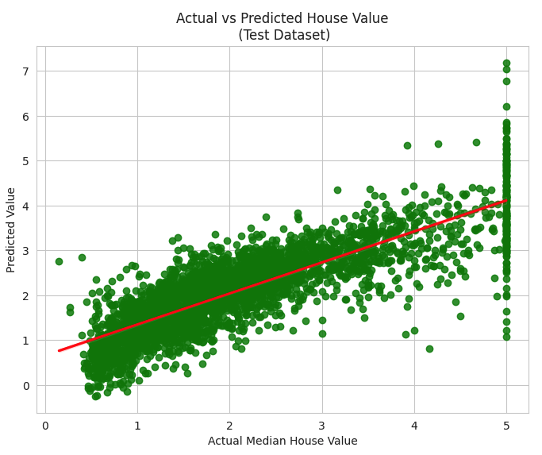

# Python Deep Learning Examples

A collection of Jupyter Notebooks (Google Colab) that demonstrate common machine learning techniques in Python.

## TensorFlow Keras - Logistic Regression on Housing Prices

[Notebook](TensorFlow_Keras_Tabular_Data_Regression.ipynb)

**Results Summary**

